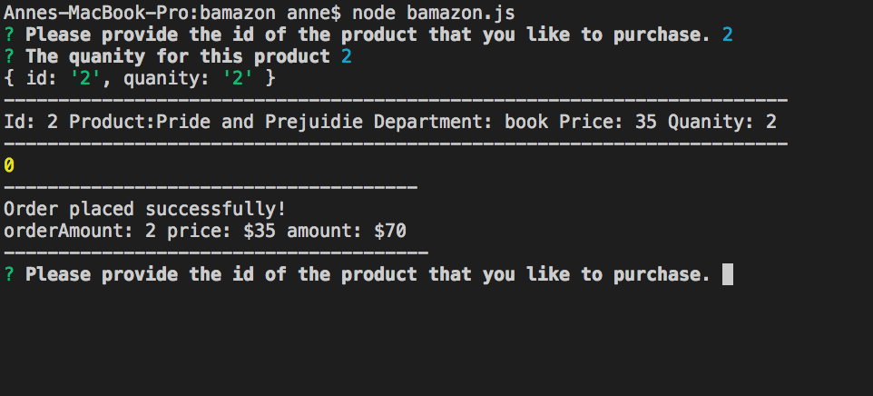
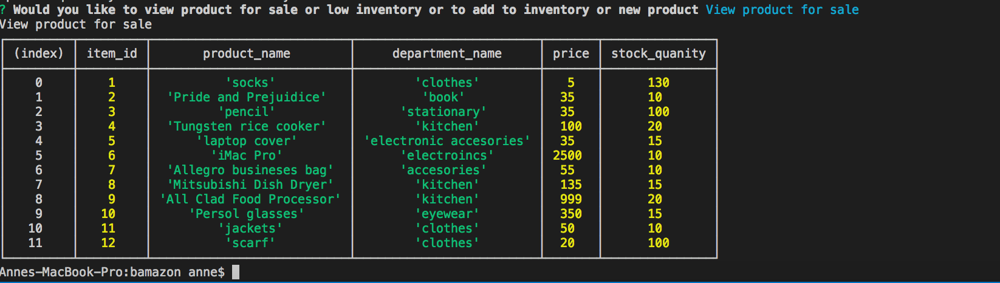
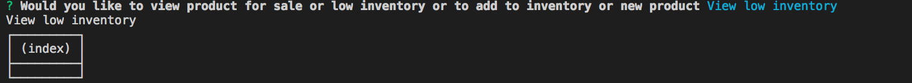
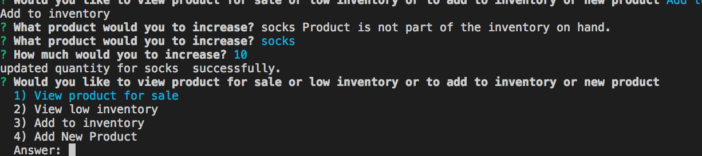
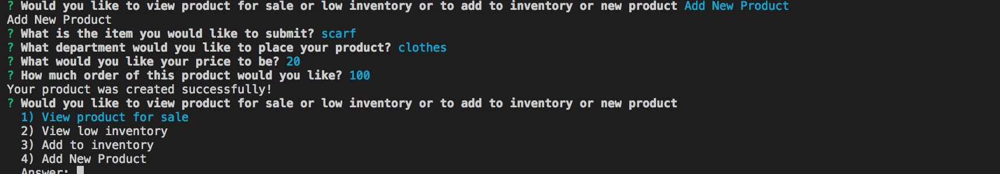

# bamazon

# Summary

bamazon is a purchase app.
Users input the id and the quantity of the product that they want to purchase. The product information is updated as well after users purchase.

BamazonManager is a inventory app.
Managers choose from a list a set of menu options:

    * View Products for Sale (View all products info.)

    * View Low Inventory (View all products less than 5 in the inventory.)

    * Add to Inventory(Add more to the products on hand.)

    * Add New Product(Add new product to the inventory.)

## To Get Started

To get started with the Bamazon app, go to bamazon.js. Get into the terminal for Bamazon.js. Then type the command node Bamazon.js. The app will start.

To get started with the bamazonManager app, go to bamazon.js. Get into the terminal for Bamazon.js. Then type the command node Bamazon.js. The app will start.

## Screenshots

Screenshots is provided below for the Bamazon.js.

Screenshots are provided below for the bamazonManager.js

- View Products for Sale
  
- View Low Inventory
  
- Add to Inventory
  
- Add New Product
  

## More Info On Bamazon and bamazonManager.js

This app is updated and maintaned by the Github user ac5599656. If you have further questions, you can email
ac5599656@gmail.com

## Technology Used

JavaScript/Node/Inquirer.js/Cli
